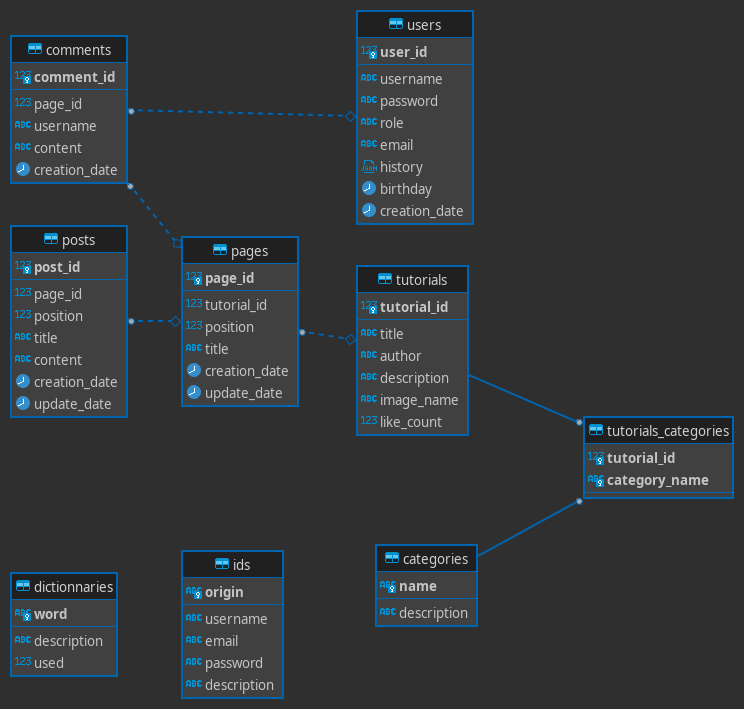

## Architecture

Database entities



## Procedure project:

1. Création du pom.xml parent:
```bash
mvn archetype:generate -DgroupId=com.clement.cdx.coco -DartifactId=coco-back
```

```xml

  <groupId>com.clement.gibert</groupId>
  <artifactId>coco-back</artifactId>
  <version>0.0.1-SNAPSHOT</version>

  <name>coco-back</name>
  <url>http://www.clement-gibert.com/</url>


<packaging>pom</packaging>

<modules>
	<module>core</module>
	<module>tools</module>
</modules>

```

2. Création des modules maven :
```bash
cd coco-back
mvn archetype:generate -DgroupId=com.cdx.coco  -DartifactId=core
mvn archetype:generate -DgroupId=com.cdx.coco  -DartifactId=tools
```

## Procedure server (PROD):

1. installation du JDK
```bash
sudo dpkg -i jdk-13.0.2_linux-x64_bin.deb
```


2. Mise en place et tests du server
```bash
unzip server

./wildfly-22.0.0.Final/bin/add-user.sh -u 'admin' -p 'PASSWORD!'

#OR

add-user.sh

What type of user do you wish to add? 
 a) Management User (mgmt-users.properties) 
 b) Application User (application-users.properties)
(a): a

Enter the details of the new user to add.
Using realm 'ManagementRealm' as discovered from the existing property files.
Username : admin
User 'admin' already exists and is enabled, would you like to... 
 a) Update the existing user password and roles 
 b) Disable the existing user 
 c) Type a new username
(a): a
Password recommendations are listed below. To modify these restrictions edit the add-user.properties configuration file.
 - The password should be different from the username
 - The password should not be one of the following restricted values {root, admin, administrator}
 - The password should contain at least 8 characters, 1 alphabetic character(s), 1 digit(s), 1 non-alphanumeric symbol(s)
...

./standalone.sh
```
Accèder à l'interface web : http://127.0.0.1:9990/
<br>

2. Installation postegreSQL et pgAdmin, démarrage et vérification:
```bash
sudo apt install postgresql postgresql-contrib
sudo service postgresql start
sudo -u postgres psql -c "SELECT version();"

vim /etc/postgresql/11/main/postgresql.conf //listen_addresses = '*'
sudo service postgresql restart
```

Télécharger le connecteur postegre SQL
ajouter le connecteur au modules du server :


```bash
mkdir -p wildfly-22.0.0.Final/modules/system/layers/base/org/postgresql/main
mv postgresql-42.2.20.jar wildfly-22.0.0.Final/modules/system/layers/base/org/postgresql/main
touch wildfly-22.0.0.Final/modules/system/layers/base/org/postgresql/main
```
<br>
ajouter au module.xml :
```xml
<?xml version='1.0' encoding='UTF-8'?>

<module xmlns="urn:jboss:module:1.1" name="com.postgresql">

    <resources>
         <resource-root path="postgresql-42.2.20.jar"/>
    </resources>

    <dependencies>
        <module name="javax.api"/>
        <module name="javax.transaction.api"/>
    </dependencies>
</module>
```

ajouter le module depuis l'interface web et se connecter.


